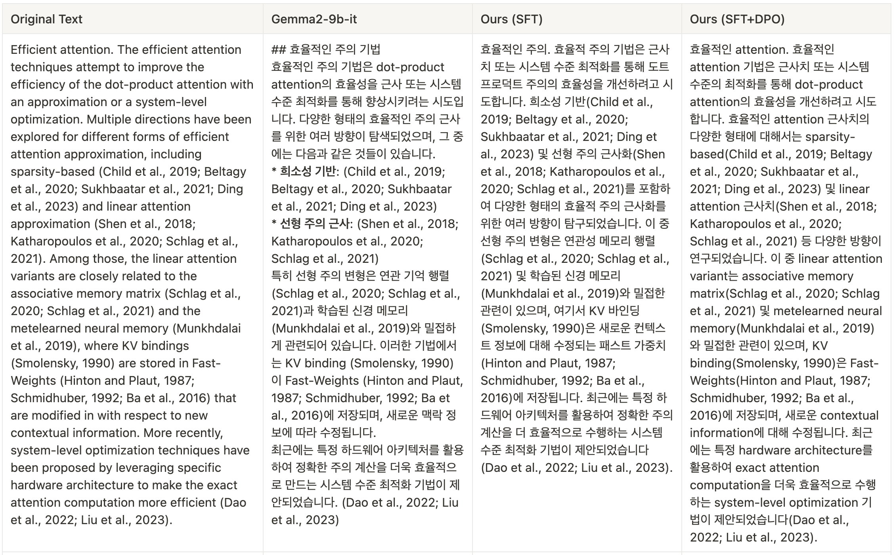
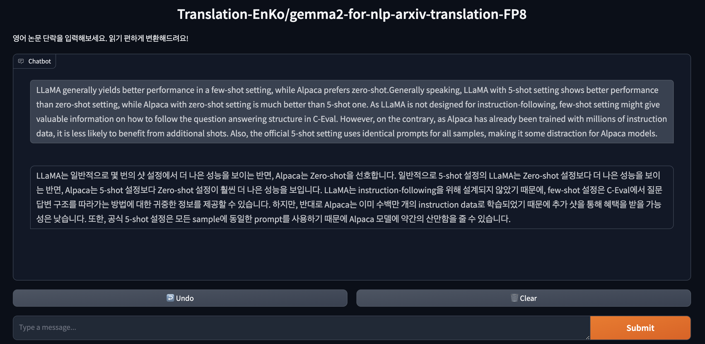

# NLP arXiv Translator for Korean NLP Researchers 🇰🇷

논문 번역은 일반적인 번역에 비해 두가지 문제점을 가지고 있습니다.
```
1. 논문의 수식을 유지 못하는 경우.
2. 전문 용어를 일반적인 단어로 번역해버리는 경우.
```
이 두가지 문제점을 해결하는 NLP 논문 번역 모델을 개발하고자 하였습니다. 

수식 번역 및 전문 용어 유지하는 고품질 전문 용어 한-영 번역 DPO 데이터셋을 제작하고, 이를 한-영 번역모델에 추가 DPO 학습시켰습니다.

- **모델**: https://huggingface.co/Translation-EnKo/gemma2-for-nlp-arxiv-translation
- **학습 데이터셋**
  -   **SFT**: https://huggingface.co/datasets/Translation-EnKo/trc_uniform_313k_eval_45_filtered
  -   **DPO**: https://huggingface.co/datasets/Translation-EnKo/nlp-arxiv-translation-dpo-with-math-10k


## 1) Data  Preparataion
수집 및 정제하여 생성된 DPO 데이터셋을 학습용 데이터셋으로 변환해 줍니다. (스페셜 토큰 추가 및 Column 이름 변경)
```
python3 data_preprocess/convert_to_chat.py
```

## 2) Train
DPO Trainer를 활용하여, LoRA 학습을 진행하는 코드입니다. GPU가 가능하다면 lora_config를 제외하여 Full-Finetuning 하셔도 됩니다.
```
CUDA_VISIBLE_DEVICES=0,1,2,3 torchrun --nproc_per_node 4 train_dpo.py > train_result.out
```

## 3) Demo
모델을 간단히 vllm에 서빙해두고, Streaming 형태로 답장을 받을 수 있도록 구현하였습니다. 
```
vllm serve Translation-EnKo/gemma2-for-nlp-arxiv-translation --port 1785 --api-key API_KEY_HERE
python3 demo.py
```


## 4) Results

### 번역 예시


### 데모 예시

